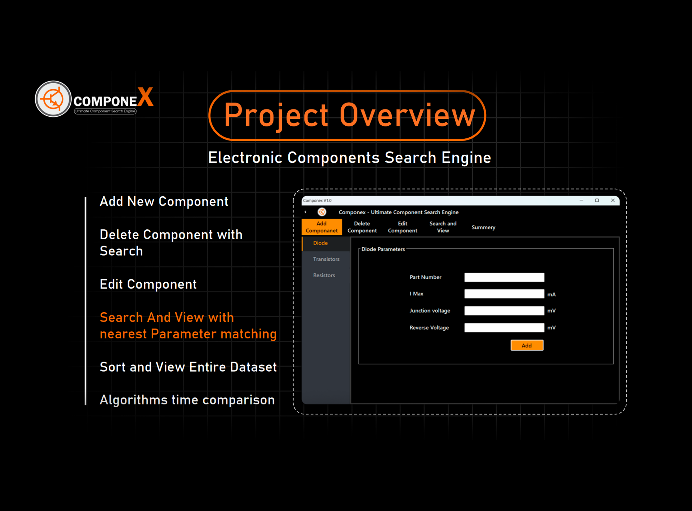

# ComponeX - Electronic Component Search Engine

## 📌 Project Overview
**ComponeX** is a smart electronic component search engine that allows users to efficiently manage and search for electronic components based on various parameters. It provides sorting options, searching functionalities, and performance analysis for different sorting algorithms.

## 📂 Features
✔️ **Add New Component**  
✔️ **Edit Existing Component**  
✔️ **Delete Components**  
✔️ **Search Components** (with nearest parameter matching)  
✔️ **Sort and View Entire Dataset**  
✔️ **Sorting Algorithms Time Comparison**

## 🚀 Technologies Used
- **C#** (Windows Forms Application)
- **SQLite** (Database)
- **Python** (Dataset Generation)
- **MATLAB** (Execution Time Analysis)
- **JSON** (Data Storage)

## 📊 Sorting Algorithms Used
ComponeX allows users to select the best sorting algorithm based on dataset size and efficiency.

| Algorithm    | Best Case | Average Case | Worst Case | Suitable For |
|-------------|----------|--------------|------------|--------------|
| **Bubble Sort** | O(n)  | O(n²)  | O(n²)  | Small datasets |
| **Merge Sort**  | O(n log n) | O(n log n) | O(n log n) | Large, stable sorting |
| **Quick Sort**  | O(n log n) | O(n log n) | O(n²) | Fast performance in large datasets |

## 📈 Performance Comparison
We measured sorting algorithm execution times using **C#'s Stopwatch**. The dataset (ranging from 10 to 1,000,000 transistors) was generated in **Python** and stored as JSON.

**Execution Time Analysis:**
- Stopwatch was used to measure sorting times.
- MATLAB was used for **theoretical analysis**, plotting results on a log scale.

## 🎥 System Demonstration
🔹 Watch the demo video below:

    <iframe allow="fullscreen" allowfullscreen height="100%" 
        src="https://streamable.com/e/3e6p2q?" width="100%" 
        style="border:none; width:100%; height:100%; position:absolute; left:0px; top:0px; overflow:hidden;">
    </iframe>

## 👥 Team Members
| Name | Registration No. | Department |
|------|----------------|------------|
| **Manodya G.P.** | EG/2022/5186 | DEIE |
| **Dassanayake D.M.B.C.** | EG/2022/4984 | COM |
| **Manthreerathnasekara H.A.S.S.** | EG/2022/5187 | DEIE |

> _Developed by DSA Project Group No.34 - Faculty of Engineering, University of Ruhuna_

